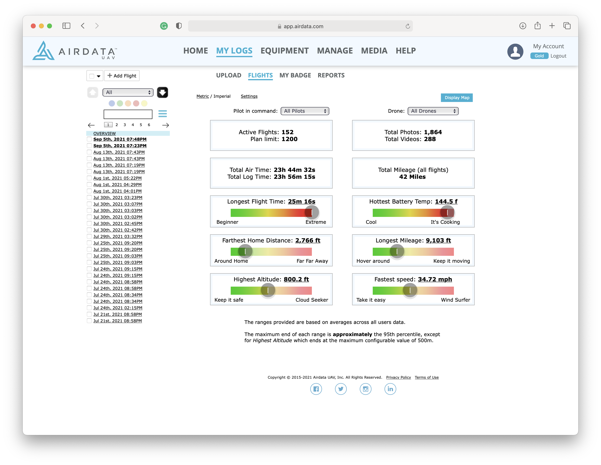
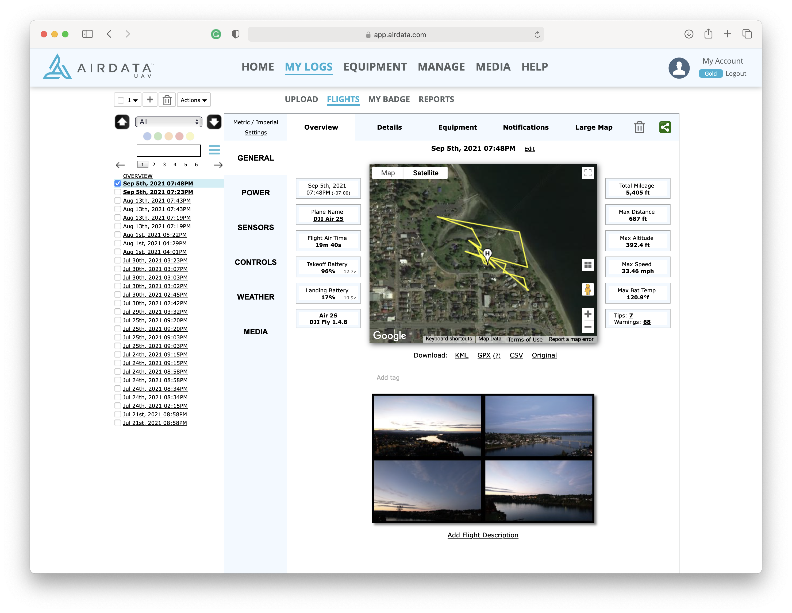

# Welcome

This repository explores if it's possible to parse and review flight data from my [DJI](https://www.dji.com) drones using open source libraries.

## The verdict?

I still have not found a way to parse flight data for my [DJI Mini 2](https://www.dji.com/mini-2) and [DJI Air 2S](https://www.dji.com/air-2s).

As of Monday, September 6th, 2021, I am still searching for libraries to process these log files - or guides discussing how to process these binary files.

The best bet to process and view your flight data is to use [Airdata](https://airdata.com):




### UPDATES

#### Friday, July 28th, 2023

I'm feeling pretty optimistic! Over the past week, there has been some noticeable activity on the [GitHub issue](https://github.com/TheRobBrennan/dji-flight-record-review/issues/10) I created for this repo at [https://github.com/TheRobBrennan/dji-flight-record-review/issues/10](https://github.com/TheRobBrennan/dji-flight-record-review/issues/10). I'd love to give a shout-out to [mcihadarslanoglu](https://github.com/mcihadarslanoglu) rekindling the flame by inquiring if there has been any update on this front - and for [howff](https://github.com/howff) pointing to the updated code at [https://github.com/dji-sdk/FlightRecordParsingLib](https://github.com/dji-sdk/FlightRecordParsingLib). Both people collaborated on getting code to work assuming you have an API key from DJI. I'm excited to see if I can make it work on my 2021 14" MacBook Pro with its  M1 Max silicon.

#### Friday, November 11th, 2022

DJI Developer Support sent me a flight record parsing library as promised. Thank you, DJI.🎉

I've consolidated my example DJI flight record data files into a new `dji/example-flight-records` folder.

#### Friday, November 4th, 2022

Hot damn! Nine days ago - Wednesday, October 26th, 2022 - I received a reply from DJI to my post on the DJI SDK forum at [https://sdk-forum.dji.net/hc/en-us/community/posts/4406193231641-How-to-parse-DJI-Mini-2-and-DJI-Air-2S-flight-records-with-Node-js-or-JavaScript?page=1#community_comment_12186290714777](https://sdk-forum.dji.net/hc/en-us/community/posts/4406193231641-How-to-parse-DJI-Mini-2-and-DJI-Air-2S-flight-records-with-Node-js-or-JavaScript?page=1#community_comment_12186290714777):

The last I did anything with DJI flight record parsing was on Monday, September 20th, 2021 - which would have been one year, one month, and five days before the response from DJI. Was this too good to be true?

> Dear Customer, Did you got the parsing Lib for DJI Log file(.txt format) ? Thanks DJI SDK Group

Could it be? I responded with the following:

> Hi there! No, I did not have any luck. It seems the logs for the Mini 2 and Air 2S are encrypted and unable to be parsed.
>
> Is there an updated library where I could parse those TXT files? I can see them on my phone, and Airdata can parse them as an example, but copying and trying to parse one of those logs without some decryption seems like it isn't doable.
>
> Is there a JavaScript library I could use to parse these files that you're aware of?

Much to my pleasant surprise, DJI responded (~19 hours ago as of this writing) with:

> Dear Customer, I could provide the latest parsing lib which is C++ based, please read carefully about our "Flight Record Parsing API License Agreement" here: https://developer.dji.com/cn/policies/flight_record/ , if you fully agree with it please reply "I represent that I have the authority to bind XXX(Company name) to this Agreement, and I fully understand and agree with the Flight Record Parsing API License Agreement", this is the first necessary step to access to our Parsing Lib, after this, our developer could start to send you the open sourced lib and "readme & manual" of APIs which will teach you how to implement it in your server. Feel free to reach out to me for any help, thanks! Thanks DJI SDK Group

I reviewed the license agreement, and everything appeared to be above board. I responded with:

> I represent that I have the authority to bind The Rob Brennan (sole proprietorship) to this Agreement, and I fully understand and agree with the Flight Record Parsing API License Agreement

Let's see if I can kick the dust off this project and parse my logs. Fingers crossed 🤞

#### Monday, September 20th, 2021

As of Monday, September 20th, 2021, I was pointed in the direction of [this post](https://djisdksupport.zendesk.com/hc/en-us/articles/4404500498713--When-the-MSDK-for-Mini-2-Mini-SE-and-Air-2S-will-be-released-?fbclid=IwAR3RPodE0Q8jteD9nnk0CDaHU6bzDNcumcPjdpFaRm6cB3I6qpf_-Rl5s5U) on the [DJI Developer Forums](https://djisdksupport.zendesk.com/hc/en-us/articles/4404500498713--When-the-MSDK-for-Mini-2-Mini-SE-and-Air-2S-will-be-released-?fbclid=IwAR3RPodE0Q8jteD9nnk0CDaHU6bzDNcumcPjdpFaRm6cB3I6qpf_-Rl5s5U).


I'm encouraged to see that there are plans to make this data available for parsing and review.

#### Thursday, September 9th, 2021

As of Thursday, September 9th, 2021, I decided to bite the bullet and see if posting in the [DJI Developer Forums](https://djisdksupport.zendesk.com/hc/en-us/community/posts/4406193231641-How-to-parse-DJI-Mini-2-and-DJI-Air-2S-flight-records-with-Node-js-or-JavaScript) will result in any forward progress:


## What didn't work?

### node-djiparsetxt

My first experiment was to explore the [node-djiparsetxt](https://github.com/chrisvm/node-djiparsetxt) code available at [https://github.com/chrisvm/node-djiparsetxt](https://github.com/chrisvm/node-djiparsetxt).

**SPOILER ALERT: I was not able to get it to work with `npx` when I tried doing `npx node-djiparsetxt <path/to/file.txt>`**

I added the following scripts to explore [node-djiparsetxt](https://github.com/chrisvm/node-djiparsetxt):

- `djiparsetxt` - This launches the `--help` command to see what options are possible for the command-line tool
- `djiparsetxt:mini-2:failed-experiment` - This attempts to parse the flight record file for the [DJI Mini 2](https://github.com/TheRobBrennan/dji-flight-record-review/blob/main/dji/mini-2/DJIFlightRecord_2021-09-05_%5B19-23-47%5D.txt)
- `djiparsetxt:air-2S:failed-experiment` - This attempts to parse the flight record file for the [DJI Air 2S](https://github.com/TheRobBrennan/dji-flight-record-review/blob/main/dji/air-2s/DJIFlightRecord_2021-09-05_%5B19-47-57%5D.txt)

The current code for [node-djiparsetxt](https://github.com/chrisvm/node-djiparsetxt) does not work with these files. However, I have opened up an issue on GitHub at [Does not work for Mini 2 or Air 2S #22](https://github.com/chrisvm/node-djiparsetxt/issues/22) to report this finding.

### dji-log-parser

My second experiment was to explore the [dji-log-parser](https://github.com/mikeemoo/dji-log-parser) code available at [https://github.com/mikeemoo/dji-log-parser](https://github.com/mikeemoo/dji-log-parser).

Admittedly, this was going to be a long shot. The last commit was on October 23rd, 2017 - using an example DJI Flight Record file from 2015. While this library **did** work and generate an image for the initially supplied file, it did not work at all with the [DJI Mini 2](https://github.com/TheRobBrennan/dji-flight-record-review/blob/main/dji/mini-2/DJIFlightRecord_2021-09-05_%5B19-23-47%5D.txt) and [DJI Air 2S](https://github.com/TheRobBrennan/dji-flight-record-review/blob/main/dji/air-2s/DJIFlightRecord_2021-09-05_%5B19-47-57%5D.txt) - nearly four years into the future. However, I have opened up issue [Does not work with the Mini 2 or Air 2S #22](https://github.com/mikeemoo/dji-log-parser/issues/22) to report these findings.

If you would like to experiment with this, feel free to navigate to `failed-experiments/dji-log-parser` and install the project dependencies and build the code:

```sh
$ cd failed-experiments/dji-log-parser
$ npm install
$ npm build
```

Then, go to `failed-experiments/dji-log-parser/examples/example.js` and specify the filename you would like to use:

```js
// failed-experiments/dji-log-parser/examples/example.js
...
// This works - the original example from 2015
// var fileName = "DJIFlightRecord_2015-12-29_[19-05-48].txt"

// This DOES NOT work - my example from 2021
var fileName = "DJIFlightRecord_2021-09-05_[19-23-47].txt"
...
```

I added the following scripts to explore [dji-log-parser](https://github.com/mikeemoo/dji-log-parser):

- `djilogparser:failed-experiment` - This launches the [dji-log-parser](https://github.com/mikeemoo/dji-log-parser) example at [failed-experiments/dji-log-parser/examples/example.js](failed-experiments/dji-log-parser/examples/example.js)

## What am I currently flying?

I have two drones that I am flying at the moment - the [DJI Mini 2](https://www.dji.com/mini-2) and the [DJI Air 2S](https://www.dji.com/air-2s).

### DJI Mini 2


### DJI Air 2S


